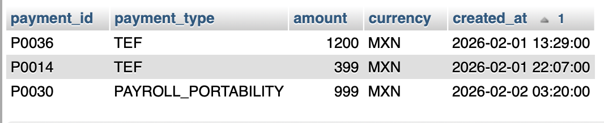
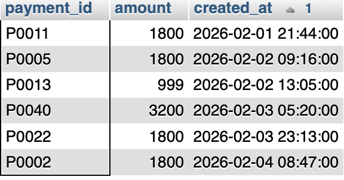
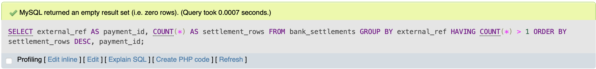
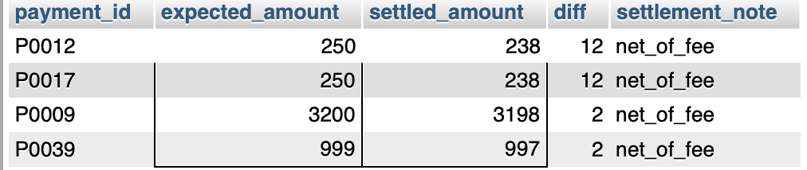
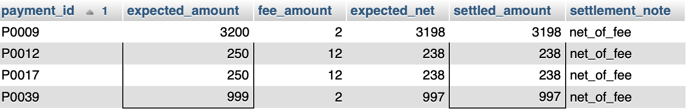

# Financial Reconciliation SQL Lab (MySQL)

Synthetic dataset + SQL exercises to practice fintech-style **financial reconciliation**:
- completeness checks (missing settlements)
- internal booking gaps (missing ledger entries)
- duplicate detection
- amount mismatch triage (net-of-fee vs true mismatch)
- currency mismatches

## Repo structure
- `sql/` — schema + task queries
- `data/` — synthetic CSV datasets (safe for public sharing)
- `generator/` — python script to regenerate data
- `docs/` — import tips for restricted labs (e.g., phpMyAdmin without LOCAL INFILE)

## Quickstart

1) Create tables:
```sql
SOURCE sql/00_schema.sql;
```

2) Import CSVs (phpMyAdmin Import). If headers cause problems in your lab, use `*_no_header.csv`.
See `sql/01_import_notes.md`.

3) Run tasks in order:
- `sql/10_task1_missing_settlements.sql`
- `sql/11_task2_missing_ledger.sql`
- `sql/12_task3_duplicate_settlements.sql`
- `sql/13_task4_amount_mismatch.sql`
- `sql/14_task5_currency_mismatch.sql`

## Safety note
All data is synthetic and randomly generated.


**Guaranteed scenario:** at least one COMPLETED payment has a ledger entry but NO bank settlement.

One such payment_id: `P0014`

## Results

### Task 1 (external settlement timing / confirmation issues)

We identified three completed payments without settlement confirmation. Two are TEF payments and one is payroll portability. Based on creation times, one item is aged and requires investigation, while the remaining two are likely timing-related and should be monitored



### Task 2 (internal accounting booking failures)




### Task 3



### Task 4



### Task 5

